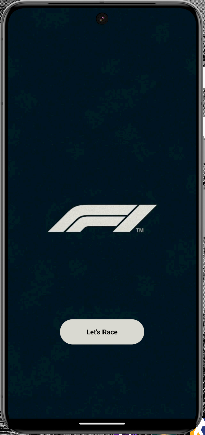
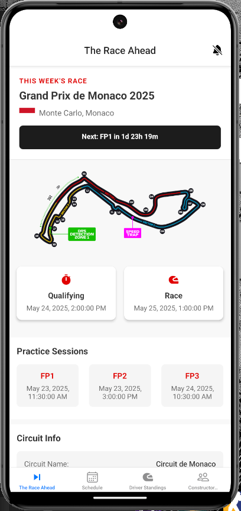
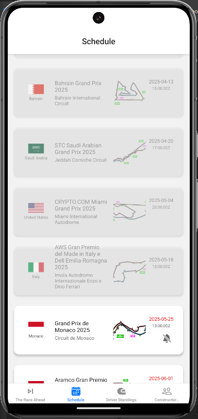
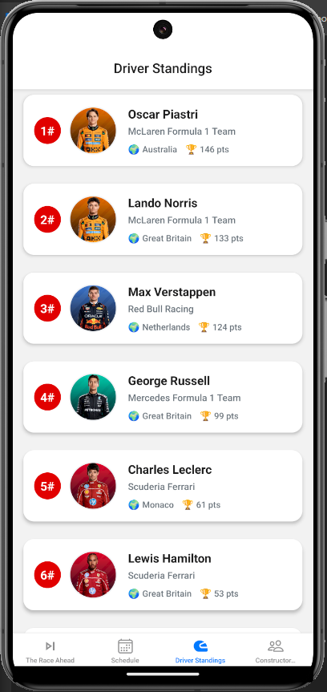
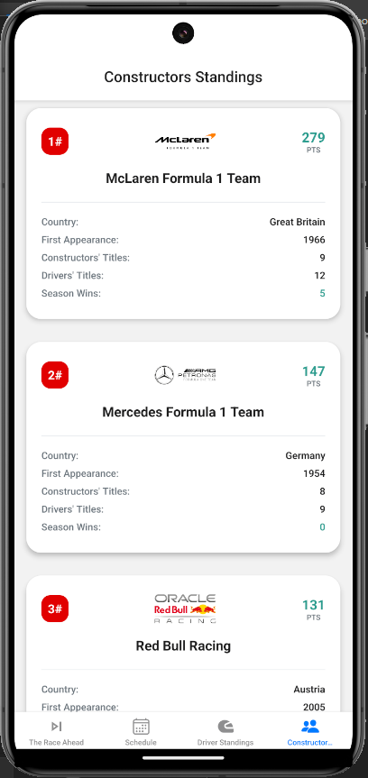
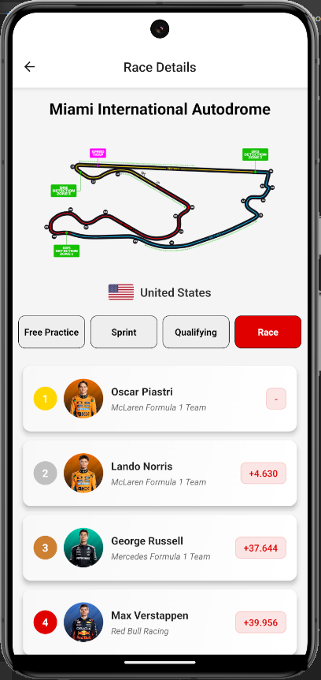
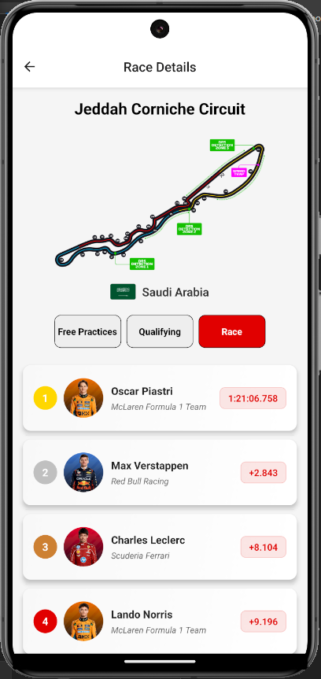

# 🏁 DRS Zone

**DRS Zone** is a cross-platform mobile application providing real-time insights into Formula 1 racing. Stay up to date with race schedules, current standings, constructor rankings, and detailed race results — all in one place.

---

## 📦 Tech Stack

- **Framework**: React Native (TypeScript)
- **Navigation**: React Navigation
- **State Management**: Redux Toolkit
- **Networking**: Axios
- **Backend API**: [F1 API](https://f1api.dev/docs/teams)
- **UI Enhancements**: Expo, Expo AV, Linear Gradient

---

## 📱 Platforms

- Android
- iOS

---

## 🚀 Getting Started

Clone the repository and install dependencies to get started:

## 🧠 Upcoming Feature: AI-Based Race Result Predictions

We're working on integrating a smart AI model into **DRS Zone** that will predict upcoming race results based on historical data, driver performance, team statistics, and track-specific factors.

### 🔮 What to Expect:
- Machine learning model trained on past seasons and live data
- Predictive analytics for podium finishes, fastest laps, and points
- Visual insights and confidence scores for each prediction
- Seamless integration into the race details screen

| Screen | Description |
|--------|-------------|
|  | **Intro Screen** App splash and welcome screen |
|  | **Current Week Info** Displays details of the current race week including circuit, date, and session times |
|  | **Schedule** Complete season calendar with upcoming and past races |
|  | **Driver Standings** Live leaderboard of F1 drivers with points and ranks |
|  | **Constructor Standings** Team rankings throughout the season |
|  | **Race Details - 1** Detailed overview of a selected race including position, driver stats, and laps |
|  | **Race Details - 2** Additional insights such as fastest lap, pit stops, and highlights |